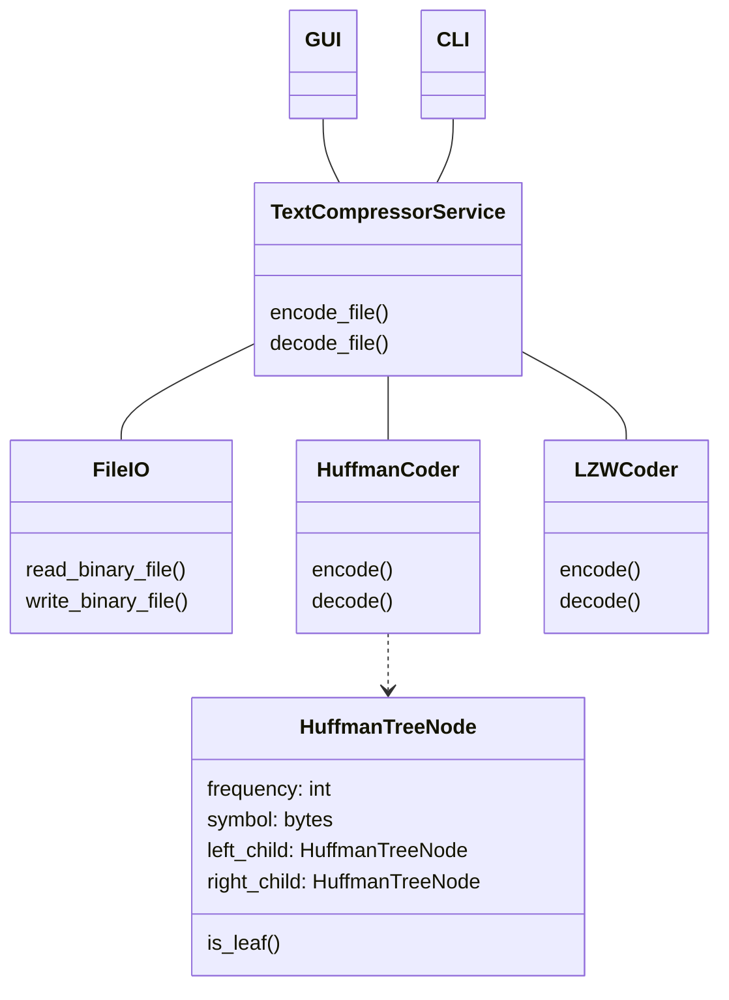
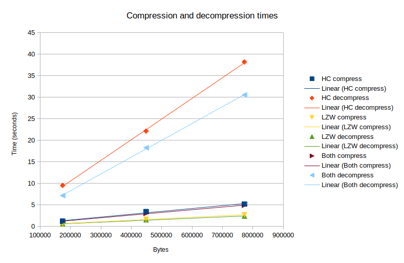

# Toteutusdokumentti

## Ohjelman yleisrakenne
Ohjelman luokkakaavio:


Ohjelman ytimen muodostaa TextCompressionService-luokka, joka tarjoaa käyttöliittymäluokille metodit tiedostojen pakkaamiseen ja pakkauksen purkamiseen. Tiedostojen lukemisesta ja kirjoittamisesta vastaa FileIO-luokka. Varsinaisesta pakkauksesta vastaa kaksi luokkaa: HuffmanCoder ja LZWCoder. HuffmanCoder hyödyntää Huffmanin puun luomisessa ja käsittelyssä HuffmanTreeNode-luokkaa.

## Suorituskyky ja O-analyysivertailu
Ohjelmalle voi ajaa suorituskykytestit komennolla `poetry run invoke performance-test`. Komennolla saadaan seuraavan kaltaiset tulosteet:

```
### Text Compressor, performance tests ###

## Removing old test files
File src/tests/performance_test_files/alice_huffman_coding_compressed removed
File src/tests/performance_test_files/alice_huffman_coding_decompressed removed
File src/tests/performance_test_files/alice_lzw_compressed removed
File src/tests/performance_test_files/alice_lzw_decompressed removed
File src/tests/performance_test_files/alice_both_compressed removed
File src/tests/performance_test_files/alice_both_decompressed removed
File src/tests/performance_test_files/frankenstein_huffman_coding_compressed removed
File src/tests/performance_test_files/frankenstein_huffman_coding_decompressed removed
File src/tests/performance_test_files/frankenstein_lzw_compressed removed
File src/tests/performance_test_files/frankenstein_lzw_decompressed removed
File src/tests/performance_test_files/frankenstein_both_compressed removed
File src/tests/performance_test_files/frankenstein_both_decompressed removed
File src/tests/performance_test_files/pride_and_prejudice_huffman_coding_compressed removed
File src/tests/performance_test_files/pride_and_prejudice_huffman_coding_decompressed removed
File src/tests/performance_test_files/pride_and_prejudice_lzw_compressed removed
File src/tests/performance_test_files/pride_and_prejudice_lzw_decompressed removed
File src/tests/performance_test_files/pride_and_prejudice_both_compressed removed
File src/tests/performance_test_files/pride_and_prejudice_both_decompressed removed

## Testing huffman coding method

# Compress Alice
File compressed, elapsed time: 1.20 seconds
Original file size 174392 bytes, compressed size 104588
Compression ratio 59.97 %

# Decompress Alice
File decompressed, elapsed time: 9.51 seconds
Decompressed file size 174392 bytes
Original file size 174392 bytes
File sizes equal: True

# Compress Frankenstein
File compressed, elapsed time: 3.45 seconds
Original file size 448965 bytes, compressed size 254651
Compression ratio 56.72 %

# Decompress Frankenstein
File decompressed, elapsed time: 22.12 seconds
Decompressed file size 448965 bytes
Original file size 448965 bytes
File sizes equal: True

# Compress Pride and Prejudice
File compressed, elapsed time: 5.19 seconds
Original file size 772448 bytes, compressed size 446862
Compression ratio 57.85 %

# Decompress Pride and Prejudice
File decompressed, elapsed time: 38.16 seconds
Decompressed file size 772448 bytes
Original file size 772448 bytes
File sizes equal: True

## Testing lzw method

# Compress Alice
File compressed, elapsed time: 0.65 seconds
Original file size 174392 bytes, compressed size 79716
Compression ratio 45.71 %

# Decompress Alice
File decompressed, elapsed time: 0.58 seconds
Decompressed file size 174392 bytes
Original file size 174392 bytes
File sizes equal: True

# Compress Frankenstein
File compressed, elapsed time: 1.67 seconds
Original file size 448965 bytes, compressed size 201926
Compression ratio 44.98 %

# Decompress Frankenstein
File decompressed, elapsed time: 1.51 seconds
Decompressed file size 448965 bytes
Original file size 448965 bytes
File sizes equal: True

# Compress Pride and Prejudice
File compressed, elapsed time: 2.71 seconds
Original file size 772448 bytes, compressed size 328180
Compression ratio 42.49 %

# Decompress Pride and Prejudice
File decompressed, elapsed time: 2.41 seconds
Decompressed file size 772448 bytes
Original file size 772448 bytes
File sizes equal: True

## Testing both method

# Compress Alice
File compressed, elapsed time: 1.19 seconds
Original file size 174392 bytes, compressed size 76589
Compression ratio 43.92 %

# Decompress Alice
File decompressed, elapsed time: 7.15 seconds
Decompressed file size 174392 bytes
Original file size 174392 bytes
File sizes equal: True

# Compress Frankenstein
File compressed, elapsed time: 3.02 seconds
Original file size 448965 bytes, compressed size 196136
Compression ratio 43.69 %

# Decompress Frankenstein
File decompressed, elapsed time: 18.25 seconds
Decompressed file size 448965 bytes
Original file size 448965 bytes
File sizes equal: True

# Compress Pride and Prejudice
File compressed, elapsed time: 4.92 seconds
Original file size 772448 bytes, compressed size 320264
Compression ratio 41.46 %

# Decompress Pride and Prejudice
File decompressed, elapsed time: 30.51 seconds
Decompressed file size 772448 bytes
Original file size 772448 bytes
File sizes equal: True
```

Suorituskykytesteistä nähdään, että Huffmanin koodauksella tiedostot saadaan pakattua noin 55-60% kokoon alkuperäisestä ja LZW-pakkauksella noin 42-46% kokoon alkuperäisestä. Molempia pakkauksia peräkkäin käyttämällä (ensin LZW, sitten Huffmanin koodaus) kokoa saadaan vielä hieman pienennettyä, mutta vain muutaman prosenttiyksikön verran verrattuna vain LZW algoritmilla pakattuihin tiedostoihin. LZW on kahdesta algoritmista selvästi nopeampi ja ero on todella merkittävä pakattuja tiedostoja purettaessa.

Alla suorituskykytestien mittausaikojen perusteella luotu kuvaaja.

Kuvaajasta näemme, että kaikilla algoritmeilla sekä pakkaus- että purkuajat kasvavat lineaarisesti tiedostokoon kasvaessa, eli aikavaativuus O(n) näyttäisi toteutuvan ainakin tämän pienen otoksen perusteella.

## Puutteet ja parannusehdotukset
Huffmanin koodauksessa käytetään bittioperaatioihin bitstring-moduulia, jonka voisi korvata omalla vastaavalla toteutuksella. Lisäksi Huffman koodatun datan purkaminen on hyvin hidasta. Yksi selitys tuolle hitaudelle voisi olla bitstring, mutta asia vaatii tarkempaa perehtymistä.

## Lähteet
Työn toteutuksessa ei ole käytetty ChatGPT:tä tai muita vastaavia tekoälyjä.

Käytetyt lähteet ja esimerkit:
- Bittikäsittely: https://realpython.com/python-bitwise-operators/
- Huffmanin koodaus:
    - Teoria: https://fi.wikipedia.org/wiki/Huffmanin_koodaus
    - Teoria: https://en.wikipedia.org/wiki/Huffman_coding
    - Keon teoria: Laaksonen, A. 2022. Tietorakenteet ja algoritmit. Helsingin yliopisto. ISBN 978-951-51-8804-5
    - Huffmanin puun pakkaus: https://stackoverflow.com/questions/759707/efficient-way-of-storing-huffman-tree
    - Esimerkki: https://www.rosettacode.org/wiki/Huffman_coding#Alternative_2
    - Esimerkki, enkoodaus: https://www.geeksforgeeks.org/huffman-coding-greedy-algo-3/
    - Esimerkki, dekoodaus: https://www.geeksforgeeks.org/huffman-decoding/?ref=lbp
- LZW:
    - Teoria: https://en.wikipedia.org/wiki/Lempel%E2%80%93Ziv%E2%80%93Welch
    - Esimerkki: https://www.geeksforgeeks.org/lzw-lempel-ziv-welch-compression-technique/
    - Esimerkki: https://www.rosettacode.org/wiki/LZW_compression#Python
